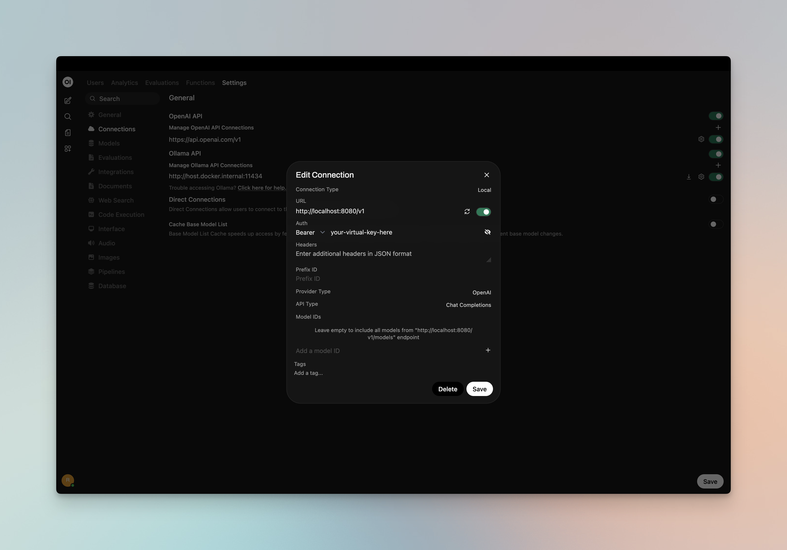
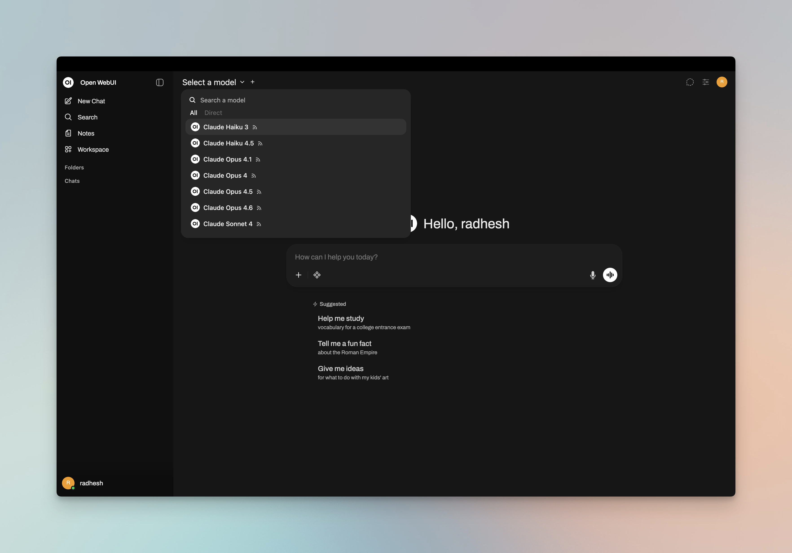
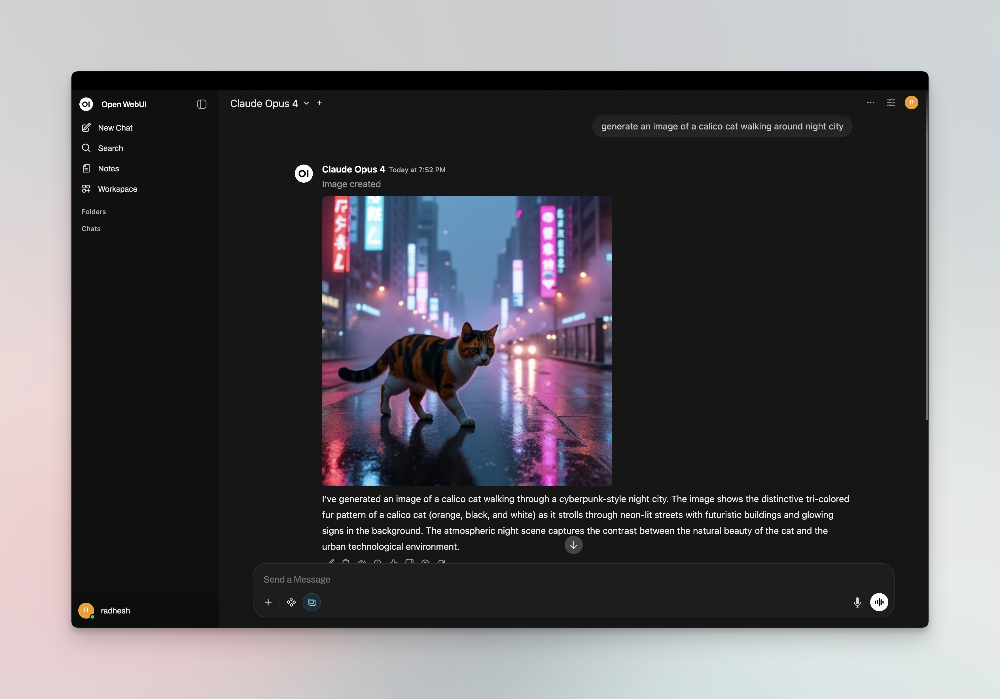
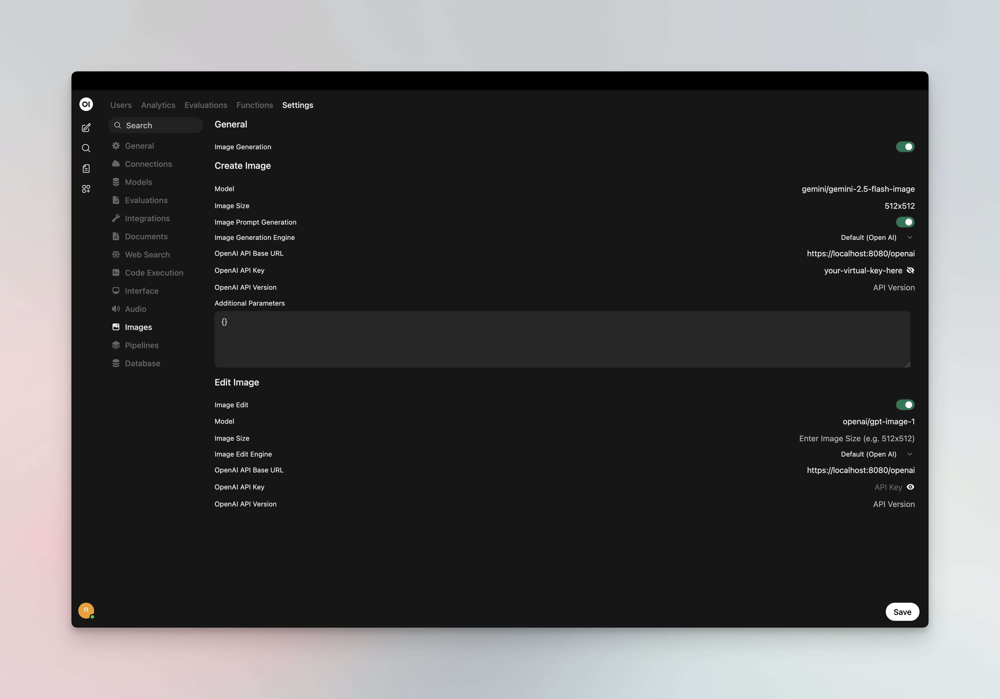

[Open WebUI](https://github.com/open-webui/open-webui) is a modern, open-source chat interface that supports OpenAI-compatible APIs. By adding UnifAI as a connection, you get access to any model configured in UnifAI through a familiar ChatGPT-like interface, plus governance features like virtual keys and built-in observability.

<Note>
If your Allowed Headers are already set to `*`, you can skip this note. If not and you face issues integrating UnifAI with Open WebUI, try switching to `*` or adding the specific headers required by your client. By default, UnifAI whitelists: `Content-Type`, `Authorization`, `X-Requested-With`, `X-Stainless-Timeout`, and `X-Api-Key`.
</Note>

## Setup

### 1. Install Open WebUI

Follow the [Open WebUI documentation](https://docs.openwebui.com/getting-started/installation/) for installation. Open WebUI can run via Docker, Docker Compose, or Kubernetes.

### 2. Add UnifAI as a Connection

<Tip>
If running Open WebUI in Docker and UnifAI is on the host machine, use `http://host.docker.internal:8080/v1` instead of `localhost`.
</Tip>

1. Open Open WebUI in your browser
2. Go to **⚙️ Admin Settings** → **Connections** → **OpenAI**
3. Click **➕ Add Connection**
4. Configure the following:

| Field | Value |
|-------|-------|
| **URL** | `http://localhost:8080/v1` (or your UnifAI host, e.g. `https://unifai.yourcompany.com/v1`) |
| **API Key** | Your UnifAI virtual key if authentication is enabled; otherwise leave empty or use `dummy` |

5. Click **Save**



### 3. Model Discovery

Open WebUI fetches available models from UnifAI's `/v1/models` endpoint. If auto-detection fails or you want to filter which models appear, add model IDs to the **Model IDs (Filter)** allowlist in the connection settings. Use UnifAI model IDs in `provider/model` format (e.g. `openai/gpt-5`, `anthropic/claude-sonnet-4-5-20250929`).



### 4. Start Chatting

Select your UnifAI connection's model from the chat model selector and start chatting.



## Virtual Keys

When UnifAI has [virtual key authentication](/features/governance/virtual-keys) enabled, set **API Key** in the connection to your virtual key. This lets you enforce usage limits, budgets, and access control per user or team.

For team deployments, create separate Open WebUI connections (or use different API keys per connection) - each virtual key can have its own rate limits, budgets, and provider access rules configured in the UnifAI dashboard.

## Per-User Attribution with OAuth/SSO

If Open WebUI uses OAuth/SSO and you want UnifAI to attribute requests to the signed-in user, configure Open WebUI to request an access token with the audience that UnifAI trusts. This usually means adding a delegated scope for that audience to Open WebUI's OAuth scopes.

The bearer token forwarded by Open WebUI should be issued for the audience configured in UnifAI. Some identity providers issue tokens for a default service unless you explicitly request the delegated scope for the audience UnifAI expects.

### Configure the OAuth Scope

1. In your OAuth/OIDC provider, create or configure the audience for the Open WebUI-to-UnifAI integration.
2. Define or identify the delegated user scope for that audience in your identity provider.
3. Add that audience scope to Open WebUI's `OAUTH_SCOPES` environment variable alongside the normal identity scopes, such as `openid`, `profile`, `email`, and `offline_access` when supported.
4. Ensure UnifAI's [enterprise OIDC/SSO](/enterprise/user-provisioning) configuration trusts the same issuer and audience.
5. Restart Open WebUI and sign in again so Open WebUI obtains a fresh token.

Example:

```bash
OAUTH_SCOPES="openid profile email offline_access <your-audience-scope>"
```

After this, the bearer token that Open WebUI forwards to UnifAI should contain the expected issuer, audience, and user claims for attribution. The exact audience scope format depends on your identity provider.

## Model Selection

Open WebUI displays models fetched from UnifAI or those you add to the Model IDs allowlist. Use UnifAI model IDs in `provider/model` format to access any configured provider:

- Use powerful models like `openai/gpt-5` or `anthropic/claude-sonnet-4-5-20250929` for complex conversations
- Use fast models like `groq/llama-3.3-70b-versatile` for quick responses

## Using Multiple Providers

UnifAI routes requests to the correct provider based on the model name. Use the `provider/model-name` format to access any configured provider through the single `/v1` endpoint:

```
anthropic/claude-sonnet-4-5-20250929
openai/gpt-5
gemini/gemini-2.5-pro
mistral/mistral-large-latest
```

### Supported Providers

UnifAI supports the following providers with the `provider/model-name` format:

`openai`, `azure`, `gemini`, `vertex`, `bedrock`, `mistral`, `groq`, `cerebras`, `deepseek`, `cohere`, `perplexity`, `xai`, `ollama`, `openrouter`, `huggingface`, `nebius`, `parasail`, `replicate`, `vllm`, `sgl`

<Note>
Open WebUI connects to UnifAI via a single OpenAI-compatible endpoint. UnifAI handles routing to the correct provider based on the model name - no per-provider configuration needed in Open WebUI.
</Note>

## Multimodality

Open WebUI supports image generation and vision (image understanding). You can use UnifAI for both.

### Image Generation

Set a UnifAI provider/model as your **image inference engine** for DALL·E-style image generation:

1. Go to **⚙️ Admin Settings** → **Settings** → **Images**
2. Set **Image Generation Engine** to **Open AI**
3. Configure:
   - **API Endpoint URL**: `http://localhost:8080/v1` (or your UnifAI host + `/v1`)
   - **API Key**: Your UnifAI virtual key if authentication is enabled
   - **Model**: UnifAI model ID in `provider/model` format (e.g. `openai/dall-e-3`, `openai/gpt-image-1`)

UnifAI routes image generation requests to the configured provider. Use any image-capable model in your UnifAI configuration (OpenAI DALL·E, GPT-Image, or other providers that support `/v1/images/generations`).



### Vision (Image Understanding)

Chat models that support vision (e.g. `openai/gpt-4o`, `anthropic/claude-sonnet-4-5`) work through your main UnifAI connection. When you select a vision-capable model in the chat selector, you can attach images to your messages - Open WebUI sends them to UnifAI, which routes to the correct provider.

## Docker Networking

Choose the correct URL for your setup:

| Setup | URL |
|-------|-----|
| Open WebUI and UnifAI on same host | `http://localhost:8080/v1` |
| Open WebUI in Docker, UnifAI on host | `http://host.docker.internal:8080/v1` |
| Both in same Docker network | `http://unifai-container-name:8080/v1` |

## Environment Variables (Alternative)

You can also configure UnifAI via environment variables when running Open WebUI:

```bash
# Single connection
OPENAI_API_BASE_URLS="http://localhost:8080/v1"
OPENAI_API_KEYS="your-unifai-virtual-key"

# Multiple connections (semicolon-separated)
OPENAI_API_BASE_URLS="http://localhost:8080/v1;https://other-gateway.com/v1"
OPENAI_API_KEYS="key1;key2"
```

## Observability

All Open WebUI traffic through UnifAI is logged. Monitor it at `http://localhost:8080/logs` - filter by provider, model, or search through conversation content to track usage across your team.

## Next Steps

- [Provider Configuration](/quickstart/gateway/provider-configuration) - Configure AI providers in UnifAI
- [Virtual Keys](/features/governance/virtual-keys) - Set up usage limits and access control
