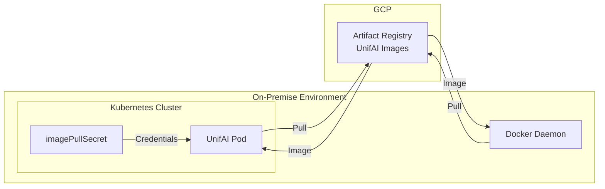

UnifAI Enterprise supports on-premise deployments for environments that cannot use cloud-native identity federation. Images are pulled from GCP Artifact Registry using username/password authentication.

## Architecture



## Prerequisites

- Kubernetes cluster (v1.23+) or Docker runtime
- Network access to `us-central1-docker.pkg.dev` (or your designated region)
- Docker credentials provided by UnifAI team

<Note>
Contact the UnifAI team to receive your Docker username and password credentials.
</Note>

## Credentials

The UnifAI team will provide you with:

| Credential | Description |
|------------|-------------|
| **Username** | `_json_key` (fixed value for GCP Artifact Registry) |
| **Password** | Service account JSON key (base64 encoded or raw JSON) |
| **Registry** | `REGION-docker.pkg.dev` (e.g., `us-central1-docker.pkg.dev`) |
| **Repository** | `REGION-docker.pkg.dev/UNIFAI_PROJECT/YOUR_HUB_SLUG` |

<Warning>
Store credentials securely. Never commit them to version control or expose them in logs.
</Warning>

## Docker Deployment

### Step 1: Login to Registry

```bash
# Using the JSON key file
cat unifai-credentials.json | docker login -u _json_key --password-stdin https://REGION-docker.pkg.dev

# Or using the password directly
docker login -u _json_key -p "$(cat unifai-credentials.json)" https://REGION-docker.pkg.dev
```

### Step 2: Pull the Image

```bash
docker pull REGION-docker.pkg.dev/UNIFAI_PROJECT/YOUR_HUB_SLUG/unifai:latest
```

### Step 3: Run UnifAI

```bash
docker run -d \
  --name unifai \
  -p 8080:8080 \
  -v /path/to/config.json:/app/data/config.json:ro \
  -v /path/to/data:/app/data \
  REGION-docker.pkg.dev/UNIFAI_PROJECT/YOUR_HUB_SLUG/unifai:latest
```

## Kubernetes Deployment

### Step 1: Create Namespace

```bash
kubectl create namespace unifai
```

### Step 2: Create imagePullSecret

<Tabs>
<Tab title="From JSON Key File">
```bash
kubectl create secret docker-registry unifai-pull-secret \
  --docker-server=REGION-docker.pkg.dev \
  --docker-username=_json_key \
  --docker-password="$(cat unifai-credentials.json)" \
  --namespace=unifai
```
</Tab>
<Tab title="From Base64 Key">
```bash
# If you received a base64-encoded key
kubectl create secret docker-registry unifai-pull-secret \
  --docker-server=REGION-docker.pkg.dev \
  --docker-username=_json_key \
  --docker-password="$(echo 'BASE64_ENCODED_KEY' | base64 -d)" \
  --namespace=unifai
```
</Tab>
<Tab title="Using YAML">
```yaml
apiVersion: v1
kind: Secret
metadata:
  name: unifai-pull-secret
  namespace: unifai
type: kubernetes.io/dockerconfigjson
data:
  .dockerconfigjson: <BASE64_ENCODED_DOCKER_CONFIG>
```

Generate the base64-encoded config:

```bash
# Create docker config
cat <<EOF > docker-config.json
{
  "auths": {
    "REGION-docker.pkg.dev": {
      "username": "_json_key",
      "password": "$(cat unifai-credentials.json | tr -d '\n')",
      "auth": "$(echo -n '_json_key:'$(cat unifai-credentials.json | tr -d '\n') | base64 -w 0)"
    }
  }
}
EOF

# Base64 encode for secret
cat docker-config.json | base64 -w 0
```
</Tab>
</Tabs>

### Step 3: Create UnifAI Configuration

<Note>
If you use PostgreSQL for `config_store` or `logs_store`, ensure the target database is UTF8 encoded. See [PostgreSQL UTF8 Requirement](../../quickstart/gateway/setting-up#postgresql-utf8-requirement).
</Note>

```yaml
apiVersion: v1
kind: Secret
metadata:
  name: unifai-config
  namespace: unifai
type: Opaque
stringData:
  config.json: |
    {
      "config_store": {
        "enabled": true,
        "type": "postgres",
        "config": {
          "host": "postgres.unifai.svc.cluster.local",
          "port": "5432",
          "user": "unifai",
          "password": "YOUR_PASSWORD",
          "db_name": "unifai",
          "ssl_mode": "disable"
        }
      },
      "logs_store": {
        "enabled": true,
        "type": "postgres",
        "config": {
          "host": "postgres.unifai.svc.cluster.local",
          "port": "5432",
          "user": "unifai",
          "password": "YOUR_PASSWORD",
          "db_name": "unifai",
          "ssl_mode": "disable"
        }
      }
    }
```

### Step 4: Deploy UnifAI

```yaml
apiVersion: apps/v1
kind: Deployment
metadata:
  name: unifai
  namespace: unifai
spec:
  replicas: 2
  selector:
    matchLabels:
      app: unifai
  template:
    metadata:
      labels:
        app: unifai
    spec:
      imagePullSecrets:
      - name: unifai-pull-secret
      containers:
      - name: unifai
        image: REGION-docker.pkg.dev/UNIFAI_PROJECT/YOUR_HUB_SLUG/unifai:latest
        ports:
        - containerPort: 8080
          name: http
        resources:
          requests:
            cpu: "250m"
            memory: "512Mi"
          limits:
            cpu: "1000m"
            memory: "2Gi"
        livenessProbe:
          httpGet:
            path: /health
            port: 8080
          initialDelaySeconds: 30
          periodSeconds: 10
        readinessProbe:
          httpGet:
            path: /health
            port: 8080
          initialDelaySeconds: 10
          periodSeconds: 5
        volumeMounts:
        - name: config
          mountPath: /app/data/config.json
          subPath: config.json
        - name: data
          mountPath: /app/data
      volumes:
      - name: config
        secret:
          secretName: unifai-config
      - name: data
        persistentVolumeClaim:
          claimName: unifai-data
---
apiVersion: v1
kind: Service
metadata:
  name: unifai
  namespace: unifai
spec:
  selector:
    app: unifai
  ports:
  - port: 80
    targetPort: 8080
    protocol: TCP
  type: ClusterIP
---
apiVersion: v1
kind: PersistentVolumeClaim
metadata:
  name: unifai-data
  namespace: unifai
spec:
  accessModes:
  - ReadWriteOnce
  resources:
    requests:
      storage: 10Gi
```

### Step 5: Expose UnifAI (Optional)

<Tabs>
<Tab title="Ingress">
```yaml
apiVersion: networking.k8s.io/v1
kind: Ingress
metadata:
  name: unifai
  namespace: unifai
  annotations:
    nginx.ingress.kubernetes.io/proxy-body-size: "50m"
spec:
  ingressClassName: nginx
  rules:
  - host: unifai.your-domain.com
    http:
      paths:
      - path: /
        pathType: Prefix
        backend:
          service:
            name: unifai
            port:
              number: 80
  tls:
  - hosts:
    - unifai.your-domain.com
    secretName: unifai-tls
```
</Tab>
<Tab title="LoadBalancer">
```yaml
apiVersion: v1
kind: Service
metadata:
  name: unifai-lb
  namespace: unifai
spec:
  selector:
    app: unifai
  ports:
  - port: 80
    targetPort: 8080
    protocol: TCP
  type: LoadBalancer
```
</Tab>
<Tab title="NodePort">
```yaml
apiVersion: v1
kind: Service
metadata:
  name: unifai-nodeport
  namespace: unifai
spec:
  selector:
    app: unifai
  ports:
  - port: 80
    targetPort: 8080
    nodePort: 30080
    protocol: TCP
  type: NodePort
```
</Tab>
</Tabs>

## Docker Compose Deployment

For simpler deployments without Kubernetes:

```yaml
version: '3.8'

services:
  unifai:
    image: REGION-docker.pkg.dev/UNIFAI_PROJECT/YOUR_HUB_SLUG/unifai:latest
    container_name: unifai
    ports:
      - "8080:8080"
    volumes:
      - ./config.json:/app/data/config.json:ro
      - unifai-data:/app/data
    environment:
      - UNIFAI_LOG_LEVEL=info
    healthcheck:
      test: ["CMD", "wget", "--no-verbose", "--tries=1", "--spider", "http://localhost:8080/health"]
      interval: 30s
      timeout: 10s
      retries: 3
      start_period: 40s
    restart: unless-stopped

  postgres:
    image: postgres:15-alpine
    container_name: unifai-postgres
    environment:
      - POSTGRES_USER=unifai
      - POSTGRES_PASSWORD=YOUR_PASSWORD
      - POSTGRES_DB=unifai
    volumes:
      - postgres-data:/var/lib/postgresql/data
    healthcheck:
      test: ["CMD-SHELL", "pg_isready -U unifai"]
      interval: 10s
      timeout: 5s
      retries: 5
    restart: unless-stopped

volumes:
  unifai-data:
  postgres-data:
```

Login to registry before running:

```bash
cat unifai-credentials.json | docker login -u _json_key --password-stdin https://REGION-docker.pkg.dev
docker compose up -d
```

## Air-Gapped Environments

For environments without internet access, you can mirror the image to your internal registry.

### Step 1: Pull Image (Internet-Connected Machine)

```bash
# Login and pull
cat unifai-credentials.json | docker login -u _json_key --password-stdin https://REGION-docker.pkg.dev
docker pull REGION-docker.pkg.dev/UNIFAI_PROJECT/YOUR_HUB_SLUG/unifai:latest

# Save to tar file
docker save REGION-docker.pkg.dev/UNIFAI_PROJECT/YOUR_HUB_SLUG/unifai:latest > unifai-image.tar
```

### Step 2: Transfer and Load (Air-Gapped Machine)

```bash
# Load image
docker load < unifai-image.tar

# Tag for internal registry
docker tag REGION-docker.pkg.dev/UNIFAI_PROJECT/YOUR_HUB_SLUG/unifai:latest \
  internal-registry.company.com/unifai:latest

# Push to internal registry
docker push internal-registry.company.com/unifai:latest
```

### Step 3: Update Kubernetes Manifests

Update the image reference in your deployment:

```yaml
containers:
- name: unifai
  image: internal-registry.company.com/unifai:latest
```

## Credential Rotation

When the UnifAI team rotates your credentials:

### Update Docker Login

```bash
cat new-credentials.json | docker login -u _json_key --password-stdin https://REGION-docker.pkg.dev
```

### Update Kubernetes Secret

```bash
# Delete old secret
kubectl delete secret unifai-pull-secret -n unifai

# Create new secret
kubectl create secret docker-registry unifai-pull-secret \
  --docker-server=REGION-docker.pkg.dev \
  --docker-username=_json_key \
  --docker-password="$(cat new-credentials.json)" \
  --namespace=unifai

# Restart deployment to pick up new secret
kubectl rollout restart deployment/unifai -n unifai
```

## Verifying Access

### Test Docker Authentication

```bash
# Verify login
docker login -u _json_key -p "$(cat unifai-credentials.json)" https://REGION-docker.pkg.dev

# Test pull
docker pull REGION-docker.pkg.dev/UNIFAI_PROJECT/YOUR_HUB_SLUG/unifai:latest
```

### Verify Kubernetes Secret

```bash
# Check secret exists
kubectl get secret unifai-pull-secret -n unifai

# Verify secret content (base64 encoded)
kubectl get secret unifai-pull-secret -n unifai -o jsonpath='{.data.\.dockerconfigjson}' | base64 -d
```

## Troubleshooting

### ImagePullBackOff Errors

```bash
# Check pod events
kubectl describe pod -l app=unifai -n unifai

# Common issues:
# - "unauthorized": Invalid credentials - check username/password
# - "not found": Wrong repository path - verify with UnifAI team
# - "connection refused": Network issue - check firewall rules
```

### Network Connectivity

```bash
# Test DNS resolution
nslookup REGION-docker.pkg.dev

# Test HTTPS connectivity
curl -v https://REGION-docker.pkg.dev/v2/

# Required outbound access:
# - REGION-docker.pkg.dev:443
# - oauth2.googleapis.com:443 (for token refresh)
```

### Credential Issues

```bash
# Verify JSON key format
cat unifai-credentials.json | jq .

# Check key hasn't expired
cat unifai-credentials.json | jq '.private_key_id'

# Contact UnifAI team if credentials are invalid
```

## Security Best Practices

1. **Store credentials securely**: Use a secrets manager (Vault, AWS Secrets Manager) for credential storage
2. **Limit access**: Only grant imagePullSecret access to required namespaces
3. **Rotate regularly**: Request credential rotation from UnifAI team periodically
4. **Audit access**: Monitor image pull logs for unauthorized access attempts
5. **Network isolation**: Restrict outbound access to only required registry endpoints

## Next Steps

- Configure [UnifAI settings](/quickstart/gateway/setting-up) for your use case
- Set up [observability](/features/observability/default) for monitoring
- Enable [clustering](/enterprise/clustering) for high availability
