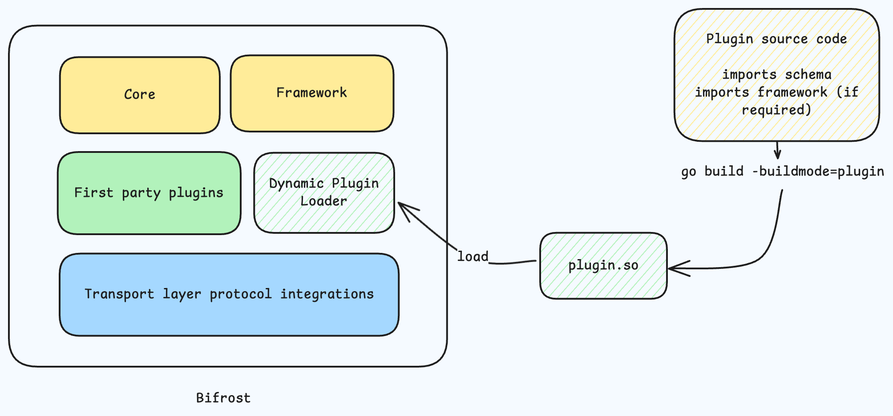

<Note>
Dynamic plugins require dynamic builds of UnifAI which are not enabled by default to keep UnifAI setup easier. If you want to build and try custom plugins on OSS read [building dynamically linked UnifAI binary](./building-dynamic-binary)
</Note>


## What are UnifAI Plugins?

UnifAI plugins allow you to extend the gateway's functionality by intercepting requests and responses. Plugins can modify, log, validate, or enrich data as it flows through the system, giving you powerful hooks into UnifAI's request lifecycle.

## Use Cases

Custom plugins enable you to:

- **Transform requests and responses** - Modify data before it reaches providers or after it returns
- **Add custom validation** - Enforce business rules on incoming requests
- **Implement custom caching** - Cache responses based on custom logic
- **Integrate with external systems** - Send data to logging, monitoring, or analytics platforms
- **Apply custom transformations** - Parse, filter, or enrich LLM responses

## Plugin Architecture



UnifAI leverages **Go's native plugin system** to enable dynamic extensibility. Plugins are built as **shared object files** (`.so` files) that are loaded at runtime by the UnifAI gateway.

### How Go Plugins Work

Go plugins use the `plugin` package from the standard library, which allows Go programs to dynamically load code at runtime. Here's what makes this approach powerful:

- **Native Go Integration** - Plugins are written in Go and have full access to UnifAI's type system and interfaces
- **Dynamic Loading** - Plugins can be loaded, unloaded, and reloaded without restarting UnifAI
- **Type Safety** - Go's type system ensures plugin methods match expected signatures
- **Performance** - No IPC overhead; plugins run in the same process as UnifAI

### Building Shared Objects

Plugins must be compiled as shared objects using Go's `-buildmode=plugin` flag:

```bash
go build -buildmode=plugin -o myplugin.so main.go
```

This generates a `.so` file that exports specific functions matching UnifAI's plugin interface:

<Tabs>
  <Tab title="v1.4.x+">
    - `Init(config any) error` - Initialize the plugin with configuration
    - `GetName() string` - Return the plugin name
    - `HTTPTransportPreHook()` - Intercept HTTP requests before they enter UnifAI core (HTTP transport only)
    - `HTTPTransportPostHook()` - Intercept HTTP responses after they exit UnifAI core (HTTP transport only)
    - `PreRequestHook()` <sup>v1.6.x+</sup> - Once-per-request routing phase: decide provider/model/fallbacks
    - `PreLLMHook()` - Intercept requests before they reach providers (runs per provider attempt)
    - `PostLLMHook()` - Process responses after provider calls (runs per provider attempt)
    - `Cleanup() error` - Clean up resources on shutdown
  </Tab>
  <Tab title="v1.3.x">
    - `Init(config any) error` - Initialize the plugin with configuration
    - `GetName() string` - Return the plugin name
    - `TransportInterceptor()` - Modify raw HTTP headers/body (HTTP transport only)
    - `PreLLMHook()` - Intercept requests before they reach providers
    - `PostLLMHook()` - Process responses after provider calls
    - `Cleanup() error` - Clean up resources on shutdown
  </Tab>
</Tabs>

### Platform Requirements

**Important Limitations:**

- **Supported Platforms**: Linux and macOS (Darwin) only
- **No Cross-Compilation**: Plugins must be built on the target platform
- **Architecture Matching**: Plugin and UnifAI must use the same architecture (amd64, arm64)
- **Go Version Compatibility**: Plugin must be built with the same Go version as UnifAI

This means if you're running UnifAI on Linux AMD64, you must build your plugin on Linux AMD64 with the same Go version.

### Plugin Lifecycle

1. **Load** - UnifAI loads the `.so` file using Go's `plugin.Open()`
2. **Initialize** - Calls `Init()` with configuration from `config.json`
3. **Hook Execution** - Calls `PreRequestHook()`, `PreLLMHook()` and `PostLLMHook()` for each request
4. **Cleanup** - Calls `Cleanup()` when UnifAI shuts down

Plugins execute in a specific order:

<Tabs>
  <Tab title="v1.4.x+">
    1. `HTTPTransportPreHook` - Intercept HTTP requests (HTTP transport only)
    2. `PreRequestHook` <sup>v1.6.x+</sup> - **Once per request**, before any provider call. Routing decisions (provider/model/fallbacks) happen here and propagate to every attempt.
    3. `PreLLMHook`/`PreMCPHook` - Per provider attempt, registration order, can short-circuit requests
    4. Provider call (if not short-circuited)
    5. `PostLLMHook`/`PostMCPHook` - Per provider attempt, reverse order of PreHooks
    6. `HTTPTransportPostHook` - Intercept HTTP responses (HTTP transport only, reverse order)
  </Tab>
  <Tab title="v1.3.x">
    1. `TransportInterceptor` - Modifies raw HTTP requests (HTTP transport only)
    2. `PreHook` - Executes in registration order, can short-circuit requests
    3. Provider call (if not short-circuited)
    4. `PostHook` - Executes in reverse order of PreHooks
  </Tab>
</Tabs>

## Next Steps

Ready to build your first plugin? Choose your approach:

- **[Writing Go Plugins](./writing-go-plugin)** - Native Go plugins using shared objects (`.so` files). Best for performance and full Go ecosystem access.
- **[Writing WASM Plugins (Deprecated)](./writing-wasm-plugin)** - Legacy WebAssembly plugin guide for existing deployments. Use Go plugins for new development while webhook-based plugins are being added.
