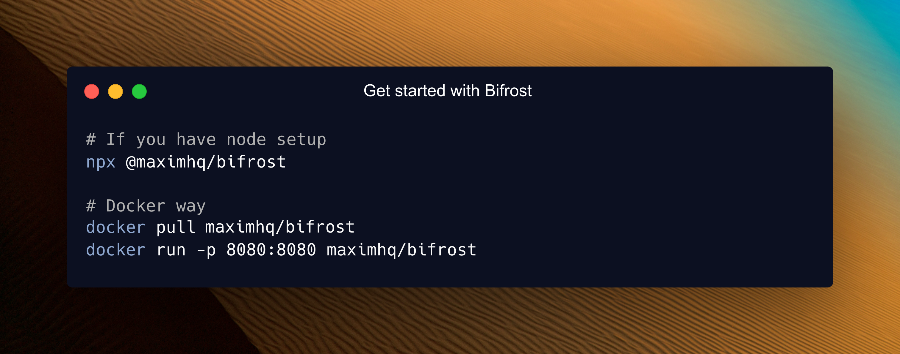
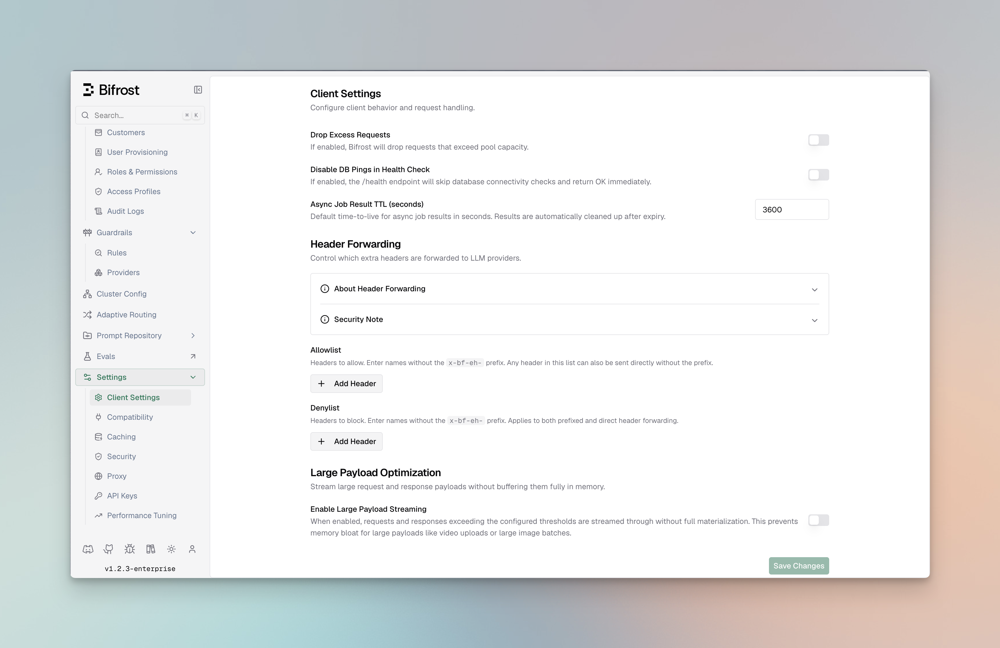

## 30-Second Setup

Get UnifAI running as a blazing-fast HTTP API gateway with **zero configuration**. Connect to any AI provider (OpenAI, Anthropic, Bedrock, and more) through a unified API that follows **OpenAI request/response format**.

### 1. Choose Your Setup Method

Both options work perfectly - choose what fits your workflow:

#### NPX Binary

<video width="100%" controls>
  <source
    src="https://github.com/unifai/unifai/raw/refs/heads/main/docs/media/run-npx.mp4"
    type="video/mp4"
  />
  Your browser does not support the video tag.
</video>

```bash
# Install and run locally
npx -y @unifai/unifai

# Install a specific version
npx -y @unifai/unifai --transport-version v1.3.9
```

#### Docker

```bash
# Pull and run UnifAI HTTP API
docker pull unifai/unifai
docker run -p 8080:8080 unifai/unifai

# Pull a specific version
docker pull unifai/unifai:v1.3.9
docker pull unifai/unifai:v1.3.9-amd64
docker pull unifai/unifai:v1.3.9-arm64
```

**For Data Persistence**

```bash
# For configuration persistence across restarts
docker run -p 8080:8080 -v $(pwd)/data:/app/data unifai/unifai
```

### 2. Configuration Flags

| Flag      | Default   | NPX               | Docker                          | Description                          |
| --------- | --------- | ----------------- | ------------------------------- | ------------------------------------ |
| port      | 8080      | `-port 8080`      | `-e APP_PORT=8080 -p 8080:8080` | HTTP server port                     |
| host      | localhost | `-host 0.0.0.0`   | `-e APP_HOST=0.0.0.0`           | Host to bind server to               |
| log-level | info      | `-log-level info` | `-e LOG_LEVEL=info`             | Log level (debug, info, warn, error) |
| log-style | json      | `-log-style json` | `-e LOG_STYLE=json`             | Log style (pretty, json)             |

**Understanding App Directory**

The `-app-dir` flag determines where UnifAI stores all its data:

```bash
# Specify custom directory
npx -y @unifai/unifai -app-dir ./my-unifai-data

# If not specified, creates in your OS config directory:
# • Linux/macOS: ~/.config/unifai
# • Windows: %APPDATA%\unifai
```

**What's stored in app-dir:**

- `config.json` - Configuration file (optional)
- `config.db` - SQLite database for UI configuration
- `logs.db` - Request logs database

**Note:** When using UnifAI via Docker, the volume you mount will be used as the app-dir.

### 3. Open the Web Interface

Navigate to **http://localhost:8080** in your browser:

```bash
# macOS
open http://localhost:8080

# Linux
xdg-open http://localhost:8080

# Windows
start http://localhost:8080
```

🖥️ **The Web UI provides:**

- **Visual provider setup** - Add API keys with clicks, not code
- **Real-time configuration** - Changes apply immediately
- **Live monitoring** - Request logs, metrics, and analytics
- **Governance management** - Virtual keys, usage budgets, and more

### 4. Test Your First API Call

```bash
curl -X POST http://localhost:8080/v1/chat/completions \
  -H "Content-Type: application/json" \
  -d '{
    "model": "openai/gpt-4o-mini",
    "messages": [{"role": "user", "content": "Hello, UnifAI!"}]
  }'
```

**🎉 That's it!** UnifAI is running and ready to route AI requests.

### What Just Happened?

1. **Zero Configuration Start**: UnifAI launched without any config files - everything can be configured through the Web UI or API
2. **OpenAI-Compatible API**: All UnifAI APIs follow OpenAI request/response format for seamless integration
3. **Unified API Endpoint**: `/v1/chat/completions` works with any provider (OpenAI, Anthropic, Bedrock, etc.)
4. **Provider Resolution**: `openai/gpt-4o-mini` tells UnifAI to use OpenAI's GPT-4o Mini model. You can also use bare model names like `gpt-4o-mini`, UnifAI will automatically resolve the provider via the [Model Catalog](/providers/provider-routing#default-provider-resolution)
5. **Automatic Routing**: UnifAI handles authentication, rate limiting, and request routing automatically

---

## Configuration Modes

UnifAI has two user-facing configuration modes:

| Mode | When to use it | Behavior |
|-------|------|----------|
| Web UI / database | You want to manage configuration from the dashboard or management API | UnifAI stores configuration in SQLite or PostgreSQL. If `config.json` is also present, it seeds or reconciles the database at startup. |
| File-only `config.json` | You want declarative, restart-based configuration with no config database | UnifAI loads configuration from the file at startup. Config-backed UI/API edits are unavailable and file changes require restart. |

<Note>
Omitting `config_store` does **not** mean file-only mode. If `config.json` exists and `config_store` is omitted, UnifAI creates the default SQLite config store and treats the file as DB-backed startup configuration. Set `config_store.enabled: false` only when the file should be the only configuration source.
</Note>

**How DB-backed `config.json` interacts with database state:**

- Entities defined in `config.json` are stored with a
  content-based hash on first load.
- Changes made later through the UI or API are persisted to the
  database and survive pod restarts, scale-ups, and redeployments.
- Re-applying the same
  `config.json` does not overwrite those database changes, because the content hash is unchanged. If
  you edit an entity directly in `config.json`, its hash changes and the file-based definition
  overwrites the database copy.
- Set `source_of_truth: "config.json"` only when explicitly present file sections should replace
  matching DB state on startup. Missing sections leave DB rows untouched; present empty sections can
  prune matching DB rows.

For the full reconciliation rules, see [Source of Truth & Reconciliation](/deployment-guides/config-json/source-of-truth).

### Mode 1: Web UI / Database Configuration



**When the UI is available:**

- No `config.json` file exists (UnifAI auto-creates SQLite database)
- `config.json` exists with `config_store` omitted or enabled

### Optional: DB-backed config.json

<Note>You can view entire config schema [here](https://www.getunifai.ai/schema)</Note>

**When to use:** Bootstrap from file, then keep runtime UI/API configuration available.

Create `config.json` in your app directory:

```json
{
  "$schema": "https://www.getunifai.ai/schema",
  "client": {
    "drop_excess_requests": false
  },
  "providers": {
    "openai": {
      "keys": [
        {
          "name": "openai-key-1",
          "value": "env.OPENAI_API_KEY",
          "models": ["gpt-4o-mini", "gpt-4o"],
          "weight": 1.0
        }
      ]
    }
  },
  "config_store": {
    "enabled": true,
    "type": "sqlite",
    "config": {
      "path": "./config.db"
    }
  }
}
```

**With `config_store` omitted or enabled:**

- **UI is enabled** - full real-time configuration via web interface
- **Database check** - UnifAI reconciles `config.json` against the config store using a content-based hash per entity
  - **Empty DB**: Bootstraps database with `config.json` settings, then uses DB for runtime reads
  - **Existing DB**: Compares each entity's file hash to the stored `ConfigHash`. In default split mode, unchanged file-backed entities keep the DB copy so UI/API edits are preserved. If you edit that entity in `config.json`, the file definition overwrites the DB copy for that entity.
- **Persistent storage** - all changes saved to database immediately

### Mode 2: File-only config.json

**When to use:** Advanced setups, GitOps workflows, or when UI is not needed.

Set `config_store.enabled` to `false` when `config.json` should be the only configuration source:

```json
{
  "$schema": "https://www.getunifai.ai/schema",
  "providers": {
    "openai": {
      "keys": [
        {
          "name": "openai-key-1",
          "value": "env.OPENAI_API_KEY",
          "models": ["gpt-4o-mini", "gpt-4o"],
          "weight": 1.0
        }
      ]
    }
  },
  "config_store": {
    "enabled": false
  }
}
```

- **Config UI/API edits are unavailable** - no config store is initialized
- **Read-only file** - UnifAI never modifies `config.json`
- **Memory-only config** - settings are loaded into memory at startup
- **Restart required** - changes to `config.json` apply after restart

**The Three Stores Explained:**

- **Config Store**: Stores provider configs, API keys, MCP settings - Required for UI functionality
- **Logs Store**: Stores request logs shown in UI - Optional, can be disabled
- **Vector Store**: Used for semantic caching - Optional, can be disabled

## PostgreSQL UTF8 Requirement

<Note>The minimum PostgreSQL version required is 16 or above.</Note>

<Note>
  For the log store, UnifAI creates materialized views to improve analytics performance. Ensure
  that the PostgreSQL user has the necessary permissions to perform these operations on the target
  schema.
</Note>

<Note>
  If you are behind PgBouncer in transaction pooling mode, RDS Proxy or any proxy that does not guarantee session affinity, UnifAI migrations may fail due to concurrent session locking issues.
</Note>

If you use PostgreSQL for `config_store` or `logs_store`, the target database must use `UTF8` encoding.

Use `template0` when creating the database so PostgreSQL applies UTF8 and locale settings explicitly:

```sql
CREATE DATABASE unifai
  WITH TEMPLATE template0
       ENCODING 'UTF8'
       LC_COLLATE '<your-locale>'
       LC_CTYPE '<your-locale>';
```

Use locale names that exist in your Postgres image/host (for example, `en_US.UTF-8`, `C.UTF-8`, or another installed UTF-8 locale).

Verify the database encoding:

```sql
SELECT datname, pg_encoding_to_char(encoding) AS encoding
FROM pg_database
WHERE datname = 'unifai';
```

If the database is not UTF8, UnifAI startup/migrations can fail with:

```text
simple protocol queries must be run with client_encoding=UTF8
```

If you already created a SQL_ASCII database, create a new UTF8 database and update your UnifAI DB config to point to it.

---

## Next Steps

Now that you have UnifAI running, explore these focused guides:

### Essential Topics

- **[Provider Configuration](./provider-configuration)** - Multiple providers, automatic failovers & load balancing
- **[Integrations](../../integrations/what-is-an-integration)** - Drop-in replacements for OpenAI, Anthropic, and GenAI SDKs
- **[Multimodal Support](./multimodal)** - Support for text, images, audio, and streaming, all behind a common interface.

### Advanced Topics

- **[Tracing](../../features/observability/default)** - Logging requests for monitoring and debugging
- **[MCP Tools](../../mcp/overview)** - Enable AI models to use external tools (filesystem, web search, databases)
- **[Governance](../../features/governance/virtual-keys)** - Usage tracking, rate limiting, and cost control
- **[Deployment](../../deployment-guides/k8s)** - Production setup and scaling

---

**Happy building with UnifAI!** 🚀
